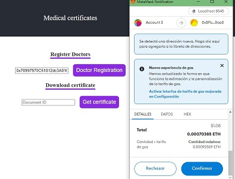
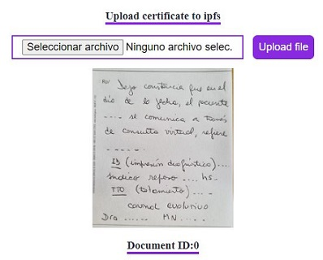
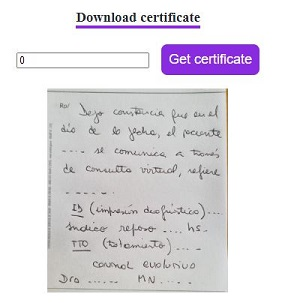

# IPFS Medical certificates

IPFS based protocol for upload and retrive medical certificates.

In some countries, it is common practice for doctors to issue a certificate to validate the worker's absence from work. Another document that doctors can issue is the one that certifies that a patient is able to perform physical activities.In the mentioned countries, the falsification of these documents by the patients is a serious problem.
This dapp allows doctors to securely issue medical certificates. As the mentioned document is stored in the IPFS system and the corresponding CID is stored in a smart contract, there is no chance for the patient to falsify the medical certificate.
When the doctor makes a certificate, he has to upload an image of it to the IPFS, through this Dapp. The system displays a corresponding CID, and the patient delivers it to the final recipient. Finally, the recipient must retrieve the mentioned certificate by entering the CID in the Dapp. Since only registered doctors can upload medical certificates to the Dapp, it is impossible for the patient to falsify those documents.

This project has three parts: doctors registration, upload medical certifications and retrieve the certifications.

In order to access to the system, users must identify themselves with their metamask wallet.You have to connect to the network localhost:8545.Depending on their role (medical company, doctor or patient), they access to diferent screens.

1. The medical company (the owner's site) register doctors in the system.
   
         

2. The registered doctors can upload medical certificates, and obtain a document ID.

    
a
3. With the ID given by the doctor, the patient retrieves the certificate from IPFS.Also, he has to send the mentioned ID to the final recipient, in order to verify      that the certificate was issued by the  doctor, and wasn't adulterated.

    


## IPFS Medical certification local mode

In order to run the system in local mode, the steps are as follow:

1. Clone the project into your computer.

2. Change into the folder of the project, and run:
```bash
npm i
```

3. It is necessary to have metamask installed. If you don't have it yet, you can download the extension for the browser you are currently using.

4.  Compile the smart contract:
```bash
npx hardhat compile
```

5.  Deploy the smart contract:
```bash
npx hardhat run --network localhost scripts/deploy.js
```

6.  Start local server:
```bash
npm start
```


"# IPFS-Medical-Certificates" 
