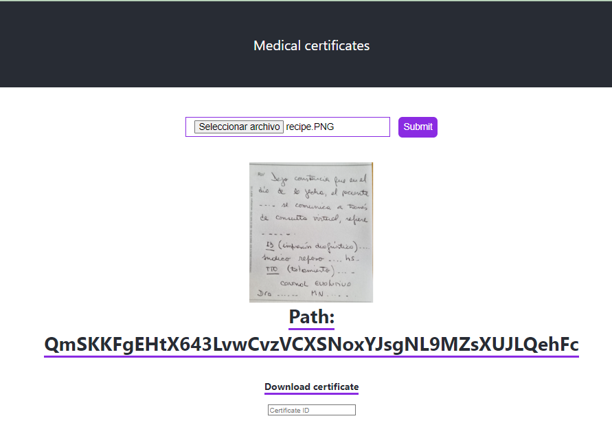

# IPFS Nedical certificates

IPFS based protocol for upload and retrive medical certificates.

This project allows doctors to send medical certificates related to work absenteeism. The system has three parts: doctors registration, upload medical certificates and its retrieveal .

In order to access the system, users must identify themselves with their metamask wallet.Depending on their role (medical company, doctor or patient), they access to diferent screens.

1. The medical company (the owner's site) registers doctors in the system.
   
   

2. The doctors registered may upload medical certificates and obtain an ipfs ID.

    

3. With the ID given by the doctor, the patient retrieves the certificate from IPFS.

    


## IPFS Medical certification Local

In order to run the system in local mode, the steps are as follow:

1. Clone the project into your computer.

2. Change into the project's folder and run:
```bash
npm i
```
3. It is necessary to have metamask installed. If you don't have it yet, you can download the extension for the browser you are currently using.

4. Add three accounts to the metamask wallet. In order to execute this project, you must install these accounts (through the private key provided):
  
  * Medical company
     * ACCOUNT ADDRESS 0xc939d487b9F6778f45776248eFaa2f24b56e4e63
     * PRIVATE KEY 885c94148a89d22dde289c29db44364a598bd647f07436714f3d1402b3296503

  * Doctor account
     * ACCOUNT ADDRESS 0x4C7EA38fBA69F3C380F28cf70cf4C15F73726d23
     * PRIVATE KEY e8f0fb12203440e277aaacf0448f70e9ad1815d2d8b47043a9ae3f83ed8d2374

 * Patient account
     * ACCOUNT ADDRESS 0x6E8693762140f69Ae47bDA410232D3BdD0E9cF08
     * PRIVATE KEY 084723002bdab8837d0d8ec0d2c8417afe65196fa4730ce9930475c5eeab1541 


5.  Start local server:
```bash
npm start
```

6. Loggin into different account types (medical company, doctor and patient) in the metamask wallet, will show you the different screens as mentioned above.
Log into the system with doctor's account, and upload the image: assets/example.png   
Copy the id that appears after path:


7. Log in  with patient's account. Enter the ID obtained in the previous step. You will see the image, retrieved from IPFS.


"# IPFS-Medical-Certificates" 
